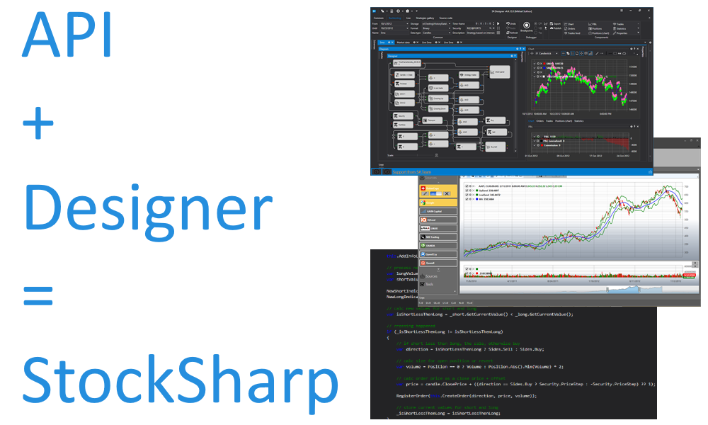

# [StockSharp - trading platform][1] 
## [Documentation][2] | [Download][3] | [Support][7] | [Algotrading training][4]

## Introduction ##

**StockSharp** (shortly **S#**) – are **free** programs for trading at any markets of the world (American, European, Asian, Russian, stocks, futures, options, Bitcoins, forex, etc.). You will be able to trade manually or automated trading (algorithmic trading robots, conventional or HFT).

## Main product:

## [1) S#.Designer][8]

## [2) S#.API][10]
S#.API is a **free** C# library for programmers who use Visual Studio. S#.API lets you create any trading strategy, from long-timeframe positional strategies to high frequency strategies (HFT) with direct access to the exchange (DMA).

## [>> All products in our store <<][9]

  [1]: https://stocksharp.com
  [2]: https://doc.stocksharp.com
  [3]: https://stocksharp.com/products/download/
  [4]: https://stocksharp.com/edu/
  [5]: https://stocksharp.com/forum/
  [6]: https://stocksharp.com/broker/
  [7]: https://stocksharp.com/support/
  [8]: https://stocksharp.com/store/strategy%20designer/
  [9]: https://stocksharp.com/store/
  [10]: https://stocksharp.com/store/api/
